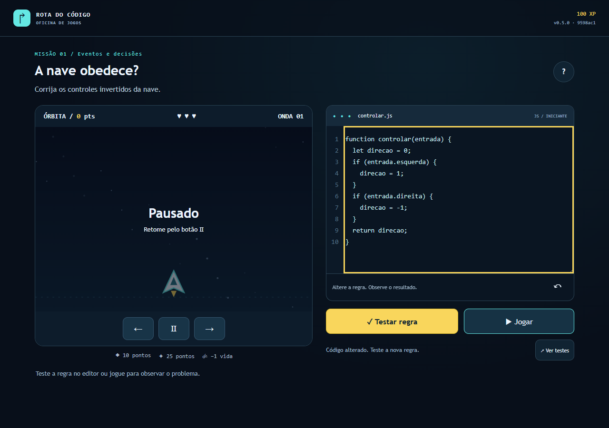

# Bug real — retomada de regra antiga após edição

Tarefa D06, INT-04, identificado em 09/10/2026 durante implementação da oficina. Não confundir com erro didático da função inicial ou bug histórico de foco #1.

## Reprodução e falha observada

Abrir primeira missão, aplicar uma função correta por Testar regra, iniciar a partida e editar o código para inverter direção. A edição pausava, mas o botão retomar continuava habilitado e podia executar a função compilada anterior. A fonte exibida não correspondia ao comportamento aplicado.

Comando: `npx playwright test tests/e2e/workshop.spec.mjs --grep "edição invalida"`. JUnit antes: um teste, uma falha em expect(#pause-game).toBeDisabled(); início19:51:33UTC (16:51:33America/Sao_Paulo). Fonte era working tree de implementação baseada no plano9598ac1, ainda sem commit; não atribuir a9598ac1 um jogo que esse commit não continha.

[JUnit anterior](bug-regra-antiga-antes.junit.xml). Referências de anexos no XML apontam para o diretório temporário original; captura copiada acima é a evidência versionada, não reconstruída. Nenhuma Issue nova foi criada para representar uma execução inexistente; o trabalho consta no PR#2.

## Correção e regressão

src/scenes/app.ts invalida aceites/fingerprint da fonte, pausa player e desabilita retomar até Testar/Jogar reaplicar. Final também exige regras aprovadas para iniciar. Implementação76b7797 no [PR#2](https://github.com/luccalck/desafio-arcade/pull/2).

Regressão em tests/e2e/workshop.spec.mjs verifica botão desabilitado após editar, ausência de execução antiga e movimento invertido real após aplicar a fonte nova. Na fonte76b7797, passou junto dos cenários de campanha desktop/exportação e mobile: três testes em17,2s. Suite da CI será conferida no acompanhamento local. Captura/falha anteriores preservadas; correção não conta como revisão humana ou publicação.
