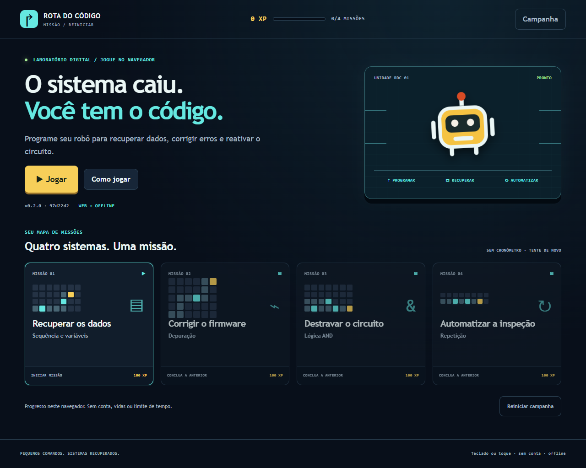
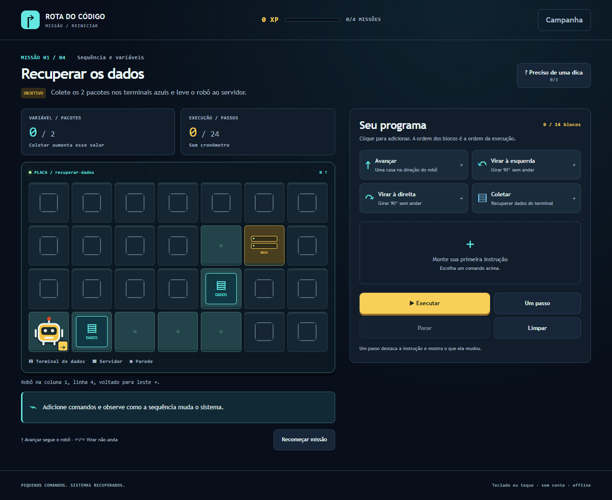

# Rota do Código - Game Design Document

Versão de projeto: **{{VERSION}}**. Data: **07/10/2026**. Conceito A e evolução das quatro missões aprovados pelo responsável nesta data. Documento da versão candidata; não há release publicada.

| Identificação | Valor nesta etapa |
|---|---|
| Jogo / atividade | Rota do Código / Desafio Arcade - Integração e Entrega Contínua, DevOps |
| Squad e quatro integrantes, nomes, RAs e papéis | Identificação será fornecida pelo responsável; ainda incompleta |
| Repositório | https://github.com/luccalck/desafio-arcade |
| Produção / homologação / vídeo | Ainda não publicados ou gravados |
| Plataforma | WEB responsiva, mesma aplicação no computador e celular |

Este GDD descreve a branch candidata e o desenho da esteira. Aprovação de conceito não é revisão de PR por outro integrante. Identificação pendente impede fechar INT-02. CPF e assinaturas não integram a versão pública; eventual versão privada será confirmada com o professor. Capturas locais não são evidências de produção ou de playtest humano.

## 1. Premissa e problema endereçado

Estudantes iniciantes em tecnologia frequentemente precisam conectar instruções abstratas ao resultado e localizar a causa de uma falha. O jogo propõe praticar sequência, variáveis, depuração, lógica booleana e repetição por mudanças observáveis em um robô e nos objetos do cenário. Público: iniciantes com leitura básica em português, sem conhecimento prévio de código. Acesso pelo navegador ou build offline, sem cadastro.

A gamificação organiza objetivos pequenos em uma campanha: executar, observar, corrigir, recuperar o sistema e ganhar uma medalha. As tentativas são ilimitadas, sem vidas ou cronômetro. XP e desbloqueios representam conclusão, não uma medição de conhecimento. A aprendizagem é uma hipótese de projeto: ainda não houve estudo ou playtest humano para comprovar eficácia ou diversão.

## 2. High concept

Rota do Código é um puzzle educativo web em que o jogador programa um robô para recuperar um laboratório digital. Após um treino guiado, quatro missões pedem coletar pacotes de dados, corrigir um firmware defeituoso, ativar dois interruptores de uma porta AND e automatizar uma inspeção usando repetição. Cada comando altera posição, dados ou sinais de forma visível; o jogador executa por passo, encontra a causa das falhas e edita o programa. Objetivos completos liberam missões e medalhas, até 400 XP. A experiência usa teclado e toque e funciona offline, sem conta. O diferencial educativo é a relação entre instrução, estado do sistema e resultado, aplicada em desafios tecnológicos concretos.

## 3. Gênero e plataforma

Puzzle educativo de programação por turnos, obrigatoriamente **WEB**, estático e responsivo. Não há aplicativo nativo, APK ou instalação de engine para jogar.

TypeScript, HTML/CSS e SVG originais, sem engine ou React. A grade discreta dispensa física, e controles HTML favorecem teclado e toque. Esbuild gera script clássico IIFE com conteúdo incorporado. Ajv valida JSON, Vitest testa core e integração, Playwright testa navegador. Node 24/lockfile são ferramentas de construção e CI; o jogador abre index.html após descompactar a build. Nenhum backend, fonte CDN ou IA em runtime é exigido.

## 4. Mecânicas-core

O jogador adiciona, substitui, remove e reordena comandos. **Avançar** move uma casa na direção atual. **Esquerda/direita** giram 90 graus sem mover. **Coletar** acrescenta o pacote de um terminal à variável pacotes; coletar novamente no mesmo terminal não duplica dados. **Ativar** liga A ou B sobre seu interruptor. A porta abre somente com A AND B = 1. Coletar/ativar fora do objeto pertinente falha com diagnóstico.

Loop: briefing/objetivo → montar programa → executar ou avançar um passo → observar trajetória, dados, sinais e comando → corrigir ou concluir. Dicas progressivas explicam estratégia sem entregar a solução inteira. Execução bloqueia edição; Parar permite editar, e nova tentativa reinicia posição, dados e sinais. O programa é preservado após falha; Recomeçar missão restaura o programa inicial.

Vitória exige chegar ao servidor com todos os pacotes requeridos e, na missão de lógica, A e B ativos. Chegar antes de completar objetivos não vence; o programa pode continuar se houver comandos. Parede, borda, porta fechada, interação inválida, programa esgotado ou limite de passos encerram a tentativa. Feedback indica causa e instrução.

| Missão | Desafio e aprendizado | Limites |
|---|---|---|
| 1 - Recuperar os dados | Sequência e variável pacotes: coletar em dois terminais antes da base | 14 blocos / 24 passos |
| 2 - Corrigir o firmware | Segunda linha inicial avança contra parede; substituir, completar rota e coletar um pacote | 18 blocos / 32 passos |
| 3 - Destravar o circuito | Ativar A e B em locais diferentes; observar tabela/saída AND e atravessar porta | 18 blocos / 32 passos |
| 4 - Automatizar a inspeção | Três terminais igualmente espaçados, representados por repetir 3 [avançar, avançar, coletar] | 4 blocos / 16 passos |

Repetição aparece na missão 4: 2 a 4 iterações, corpo de 1 a 8 ações, sem aninhamento. Um bloco representa o grupo, além dos blocos do corpo. A solução usa quatro blocos e nove passos. O treino separado usa avançar, coletar, esquerda, avançar e não concede XP.

Cada primeira conclusão concede 100 XP e medalha DADOS, DEBUG, LÓGICA ou AUTOMAÇÃO, até 400 XP, liberando a próxima missão. Replay não aumenta XP. Progresso local aceita apenas uma sequência válida dos IDs conhecidos; armazenamento bloqueado usa memória da sessão. Reset confirmado remove somente a chave do jogo. Não há ranking, monetização ou telemetria. O defeito preparado do firmware é conteúdo educativo; o bug real de software #1 é documentado separadamente.

## 5. Enredo e personagens

Um robô recupera serviços de um laboratório digital abstrato: dados, firmware, circuito e inspeção. É uma criação vetorial original, sem personagem licenciado, biografia ou diálogos. A narrativa apoia objetivos curtos e não pretende simular a arquitetura física de uma rede real. Combate, adversários e storyboard narrativo adicional não se aplicam a esta versão.

## 6. Fluxo do jogo

Menu/campanha → treino opcional → briefing → edição/execução → resultado. O treino apresenta quatro ações guiadas antes da missão independente. Falha → editar; vitória → próxima missão, replay ou campanha. Após a quarta vitória, há encerramento com quatro medalhas. Missões futuras ficam bloqueadas; concluídas podem ser revisitadas. Campanha e Parar interrompem a execução pendente. Reset é uma ação separada com confirmação e cancelamento.

## 7. Level design

Mapas são gerados do JSON versionado: escuro indica parede, verde piso, R início, T terminal, A/B interruptores e G porta. Servidor tem borda amarela; na missão 4 coincide com o terceiro terminal. Coordenadas abaixo usam o JSON, começando em 0; as imagens e o texto da interface usam coluna/linha a partir de 1. O robô começa voltado para leste. Não há recurso consumível ou mapa aleatório.

Missão 1: início (0,3), servidor (5,1), terminais (1,3) e (4,2). O trajeto exige uma coleta antes da curva e outra antes da base. Solução editorial: avançar, coletar, avançar três vezes, esquerda, avançar, coletar, avançar, direita, avançar. Onze ações.

Missão 2: início (0,4), servidor (5,0), terminal (3,2). Programa inicial [avançar, avançar] falha na segunda linha. Solução: avançar, esquerda, avançar duas vezes, direita, avançar duas vezes, coletar, avançar, esquerda, avançar duas vezes, direita, avançar. Quatorze ações. Substituição de linha favorece depuração em vez de apagar tudo.

Missão 3: início (0,3), servidor (6,3), A (1,3), B (3,2), porta (4,3). Não basta caminhar sobre os interruptores: Ativar altera o sinal. Solução: avançar, ativar, avançar duas vezes, esquerda, avançar, ativar, direita duas vezes, avançar, esquerda, avançar três vezes. Quatorze ações. O desvio obriga observar a relação entre duas entradas e saída AND.

Missão 4: início (0,1), servidor (6,1), terminais (2,1), (4,1), (6,1). Repetir 3 [avançar, avançar, coletar] coleta todos e vence no nono passo. O limite de quatro blocos torna necessária a representação do padrão. O terminal na base só é recuperado por Coletar, não pela chegada.

O validador exige retângulo, posições válidas, IDs/posições únicos, objetos no piso, número de pacotes coerente, porta com ambos os interruptores e ações disponíveis correspondentes. Executa todas as soluções editoriais e respeita budgets. JSON ou solução inválida interrompe a build. Essas soluções são contratos de teste; não são exibidas completas como dica ao jogador.

## 8. Interface do usuário - UI/UX

Laboratório digital em azul escuro, ciano para dados/conexões e amarelo para ação, robô e base. Campanha mostra quatro cartões, miniaturas do mapa, medalhas e XP. Briefing informa missão, conceito e objetivo antes de iniciar. HUD mostra pacotes, passos, direção e, na fase lógica, A/B/AND. Editor oferece comandos com efeito descrito, edição por seleção e montagem do grupo repetir. Resultado preserva mapa/traço, explica falha ou conceito e oferece próxima ação.

Capturas reais de 07/10/2026, Playwright/Chrome local, fonte 97d22d2. Não representam produção, teste humano ou imagem desenhada para simular execução. Wireframes e concept art são identificados como projeto, não capturas.

Todas as ações têm controles HTML por teclado e toque, sem arrastar obrigatório. Foco visível/restaurado após edição, link de salto, mensagens de estado, orientação textual, legendas, ícones com texto e movimento reduzido. Cor e áudio não são o único feedback. Celular usa painéis empilhados, barra de execução fixa e revela mapa ao executar. E2E verifica viewport 390x844 sem overflow, execução pela barra, navegação/foco e armazenamento bloqueado; não é certificação de acessibilidade nem teste de todos os dispositivos.

Stitch não foi utilizado. Playtest de três minutos por colega de outra turma, avaliação de clareza e revisão humana permanecem pendentes em P05.

## 9. Áudio e música

Esta versão não utiliza áudio, música ou efeito sonoro, e não contém ativos de som. Instruções e feedback são visuais/textuais. Áudio opcional futuro exige origem, licença, volume e alternativa textual registrados por PR.

## 10. Arte e referências visuais

Robô, circuitos, mapas, wireframes, concept art e diagramas são SVG/CSS criados para o projeto com assistência do Codex. Capturas PNG vêm da aplicação real. Fontes do sistema, sem arquivos de fontes ou CDN. Não foram reutilizados personagens, marcas ou imagens do modelo Word.

Referências técnicas: [esbuild IIFE](https://esbuild.github.io/api/#format), [Vitest](https://vitest.dev/guide/), [Playwright assertions](https://playwright.dev/docs/test-assertions), [ambientes GitHub](https://docs.github.com/en/actions/how-tos/deploy/configure-and-manage-deployments/manage-environments) e [GitHub Pages](https://docs.github.com/en/pages/getting-started-with-github-pages/configuring-a-publishing-source-for-your-github-pages-site). Informam escolhas técnicas; não fornecem arte copiada ao produto. Licenças/versões estão em THIRD_PARTY, lockfile e SBOM.

## 11. IA e componentes de terceiros

| Ferramenta / componente | Uso | Licença / condição |
|---|---|---|
| Codex | Leitura, concepção aprovada, código, conteúdo, testes, SVG e documentos | AI-USAGE; revisão por outro humano pendente antes do merge |
| TypeScript / esbuild | Tipos e build | Apache-2.0 / MIT |
| Ajv / Vitest / Playwright | Schema, regras e navegador | MIT / MIT / Apache-2.0 |
| Markdown-it / fflate | GDD e ZIP | MIT / MIT |
| ESLint / typescript-eslint / tsx | Lint e validação | MIT, conforme inventário |

Autores, versões e transitivas no lockfile, THIRD_PARTY e SBOM. Não houve Opal, AI Studio, Stitch ou gerador raster. Isso não dispensa revisão dos textos assistidos. Não há API IA durante partida, backend remoto, ativo terceirizado de arte, cadastro ou serviço pago necessário.

Declaração de originalidade/direitos: projeto concebido para este trabalho, com assistência de IA explicitada e licenças identificadas. Confirmação coletiva de direitos e revisão pelo squad ainda não registradas. Não há assinaturas, revisão fictícia ou aceite de termos do concurso. A entrega da UC não constitui inscrição no concurso opcional.

## 12. Ideias adicionais e próximos passos

Implementado na branch candidata: treino, quatro missões tecnológicas, objetos, variável pacotes, porta AND, editor, repetição, campanha/medalhas/XP, persistência com fallback, feedback/traço e site estático offline. Testes e capturas locais constam em docs/evidencias/evolucao-missoes.md. Não há estudo educativo ou release.

Restam revisão real e colaboração dos quatro, HML/PRD, recuperação/sondas/DORA medidos, playtest, vídeo humano legendado, triagem e relatório técnico. CI já existe e seus resultados reais são registrados por execução. Condicionais programáveis, novas fases, áudio e personalização são roadmap futuro, não compromissos desta build. Mudança de mecânica exige GDD atualizado por PR.

## Esteira

Repositório: https://github.com/luccalck/desafio-arcade . GitHub Flow/Conventional Commits; PR requer outra pessoa e check ci verde. CI push/PR verifica lint, unidade/integração/conteúdo, E2E, Gitleaks, audit, SBOM, reprodutibilidade, PDF, ZIP/hash e artefatos. IA será revisada antes do merge. CI implementada não comprova implantação.

Arquitetura planejada: gh-pages escrito apenas pela pipeline, /hml/, /releases/<sha>/ imutáveis, carregador/rollout e mesmo ZIP de HML a PRD. Estratégia azul-verde: validar nova pasta, registrar aprovação em producao, promover estavel, fazer smoke e recuperar ponteiro se falhar. Sessão conserva versão enquanto válida; rollback retira seleção inválida. Histórico registra responsável/motivo. Recuperação abaixo de cinco minutos incluindo Pages exige ensaio medido.

Sondas HTTP/latência/versão HML/PRD a cada 15 minutos, CSV em observabilidade, Issues JogoForaDoAr/LatenciaAlta e /status/. DORA real conforme enunciado, comparação com lead time de 11 dias e melhoria medida. Cron pode atrasar; ensaio usa smoke/workflow ativo. Esses componentes e dados ainda estão pendentes.

Na tag final, pipeline deve produzir submissao/GDD.pdf, LINK_DO_JOGO.txt, build.zip com LEIA-ME, pitch.mp4 humano e MANIFESTO.sha256, com triagem real. Vídeo de produção é entrada anterior ao fechamento; relatório recebe depois evidências da release/triagem. Versão/data devem coincidir com release real e links/identificação completos. Nenhum desses aceites externos é declarado concluído nesta candidata.
