# Rota do Código — Game Design Document

Versão de projeto: **{{VERSION}}**. Data: **09/10/2026**. Alternativa A, Oficina de Jogos, aprovada pelo solicitante com instrução de planejar e implementar. Documento da branch candidata, sem release ou produção desta versão.

| Identificação | Situação verdadeira |
|---|---|
| Jogo / atividade | Rota do Código / Desafio Arcade — Integração e Entrega Contínua, DevOps |
| Squad / quatro integrantes / nomes / RAs / papéis | Dados serão fornecidos pelo responsável; ainda incompletos |
| Repositório | https://github.com/luccalck/desafio-arcade |
| PR candidato | https://github.com/luccalck/desafio-arcade/pull/2 |
| Produção / homologação / vídeo / release | Ainda não publicados ou gravados |
| Plataforma | WEB estática responsiva, mesma experiência no computador e celular |

A aprovação de concepção não substitui revisão por outro integrante. CPF e assinaturas não integram Git ou artefatos públicos; eventual versão privada depende de orientação do professor. Identificação, declaração coletiva e links de release continuam pendentes. Capturas locais e testes automatizados não representam produção ou playtest humano.

## 1. Premissa e problema endereçado

Iniciantes podem memorizar comandos sem entender como uma regra altera um programa. A oficina relaciona eventos, variáveis, condições, estado e repetição a um resultado observável: construir funções de um minijogo. Público: pessoas com leitura básica em português, familiaridade com teclado/toque e sem conhecimento prévio de JavaScript. Editar código no celular pode ser mais trabalhoso e precisa de avaliação humana.

Cada missão começa com um defeito numa função curta. O jogador altera código, compara saídas para entradas diferentes e experimenta o efeito numa nave controlável. Ajuda direta fica sob demanda. Cinco missões compõem um projeto integrado exportável como HTML editável e jogável offline. XP e desbloqueios sinalizam progresso; não medem aprendizagem. Clareza, diversão e transferência de conhecimento ainda exigem playtest humano; nenhum ganho educativo foi medido.

## 2. High concept

Rota do Código é uma oficina educativa web em que o jogador constrói um minijogo de nave corrigindo cinco funções JavaScript. Controles, movimento, colisão, pontuação e criação de ondas transformam eventos, operações, condições, estado e repetição em efeitos visíveis. Cada regra precisa funcionar para entradas diferentes, com ajuda e testes públicos sob demanda. No desafio final, as cinco funções do jogador comandam uma partida real: alcançar 100 pontos com três vidas libera a exportação de um HTML independente, jogável offline e com código editável. Menus, seis missões e até 700 XP organizam a campanha. O diferencial é produzir e depurar regras de um jogo concreto, relacionando código e comportamento, em vez de repetir uma sequência de comandos ou responder apenas perguntas.

## 3. Gênero e plataforma

Jogo educativo de programação e depuração, com minijogo arcade de coleta e desvio. Destino obrigatório **WEB**, estático e responsivo; sem aplicativo nativo, APK ou instalação de engine para o jogador.

TypeScript, HTML/CSS/SVG e esbuild IIFE, sem framework de interface ou engine física. Core puro separado da renderização; Ajv valida conteúdo, Vitest testa regras/integração e Playwright testa navegador. Node 24 e lockfile são ferramentas de desenvolvimento/CI. Conteúdo, player de exportação e licença são incorporados à build; fontes locais, sem CDN. Descompactar o ZIP e abrir index.html funciona por file:// sem rede. Sem backend, conta, serviço pago ou API de IA em runtime. Nenhuma dependência nova foi necessária.

## 4. Mecânicas-core

A missão apresenta uma frase de objetivo, minijogo e editor JavaScript com linhas. O código inicial tem erro relacionado ao conceito. Testar regra compila a tentativa e compara saídas reais/esperadas em casos públicos; Jogar reinicia usando a função editada. Sintaxe e limites produzem mensagem com linha. Ajuda e casos detalhados são opcionais; nenhum botão preenche solução.

Loop: editar → testar entradas → observar partida → corrigir → concluir regra → próxima missão. Nas cinco primeiras, as outras quatro funções usam regras de apoio corretas para isolar o conceito. Aprovar os casos libera a próxima; jogar mostra o efeito, sem requisito adicional nessa etapa. O final usa as cinco fontes salvas, exige os 23 casos corretos e uma vitória na partida atual para concluir/exportar.

| Missão / função | Aprendizagem por ação | Casos públicos |
|---|---|---|
| 1 — controlar | Eventos/decisões: -1, 0 ou 1 conforme teclas; direita tem prioridade quando ambas pressionadas | 4: esquerda, direita, nenhuma, ambas |
| 2 — mover | Operações: posição + direção × velocidade; parado preserva posição | 5: sentidos, parada, velocidades diferentes |
| 3 — colidir | Condição/fronteira: distância menor ou igual ao raio | 5: centro, dentro, fronteira e fora |
| 4 — pontuar | Estado: conservar pontos; cristal +10, estrela +25, outros +0 | 5: tipos e pontos acumulados |
| 5 — criarOnda | Lista/repetição/limite: quantidade de posições começando em 40, intervalo 80 | 4: quantidades 0, 1, 3 e 5 |
| Final — Órbita | Integrar as cinco funções e pilotar o jogo produzido | 23 casos e vitória com pelo menos 100 pontos |

Arena lógica 480 × 320. Nave começa em x=240, y=270, entre x=20 e 460; velocidade de referência 4 por atualização. Atualiza a cada 20 ms; objetos descem 2,6 unidades por atualização. A cada 150 atualizações surge onda, inicialmente três objetos, crescendo até cinco. Tipos seguem padrão determinístico por onda/índice: pedras, estrelas e cristais. Colisão usa distância e raio 23; pedra retira uma vida, item colidido é removido uma vez. 100 pontos vence; zerar três vidas perde. Sem tempo limite geral, monetização ou ranking.

Saídas inválidas interrompem partida com diagnóstico: direção fora de -1/0/1, posição não finita, colisão não booleana, pontos fora de inteiro 0..9999, lista com quantidade incorreta, posições repetidas ou fora da arena. Motor clona estado/entradas; estado encerrado é idempotente. Testes verificam comportamento, sem exigir fonte igual à referência editorial.

Editor aceita subconjunto explícito de JavaScript: função com parâmetro entrada, let/const, return, if/else, operações, listas numéricas, push e for com incremento/atribuição. Sem chamadas genéricas, DOM, rede, globais ou propriedades arbitrárias. Interpretador lê AST sem eval/Function: até 6.000 caracteres, 300 nós, profundidade 20, 2.000 passos e 64 iterações por laço; arrays até 64 elementos. Limites por avaliação não significam compatibilidade com toda a linguagem.

Editar pausa e invalida resultados/regras anteriores; retomar fica desabilitado até aplicar fonte por Testar/Jogar. Pausa conserva posição, pontuação e atualizações; Jogar reinicia; sair limpa eventos/temporizadores. Perder permite tentar novamente sem apagar fontes. Correção de regra antiga tem regressão documentada.

Primeira conclusão: 100 XP por missão e 200 final, total 700, sem duplicar replay. Código/vitórias usam chaves workshop:v4; campanhas anteriores são preservadas sem desbloquear esta. Armazenamento indisponível mantém sessão. Reset confirmado remove somente código/progresso da oficina. Preferências persistem separadamente. Sem dados pessoais ou telemetria.

Baixar meu jogo após vitória final gera meu-jogo.html com cinco funções convertidas da AST para JavaScript, player, estilos e licença MIT completos. Não interpola comentários ou fonte bruta em HTML. Laços exportados têm guarda de 64 iterações por laço e 2.000 iterações acumuladas; esse contador não é idêntico ao orçamento de passos do interpretador. Arquivo abre offline e pode ser editado num editor de texto. É criação do aprendiz, distinta do build.zip/submissão acadêmica.

## 5. Enredo e personagens

RDC-01, robô mascote original, convida o jogador a reparar o protótipo Órbita. Nave é o objeto programado; coletáveis e pedras mostram pontuação/colisão. Narrativa leve, sem biografia extensa ou pretensão de simular hardware. Storyboard cinematográfico não se aplica; sequência educativa conduz progressão.

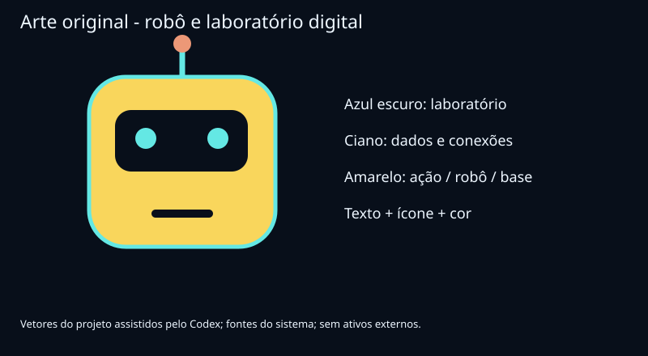

## 6. Fluxo do jogo

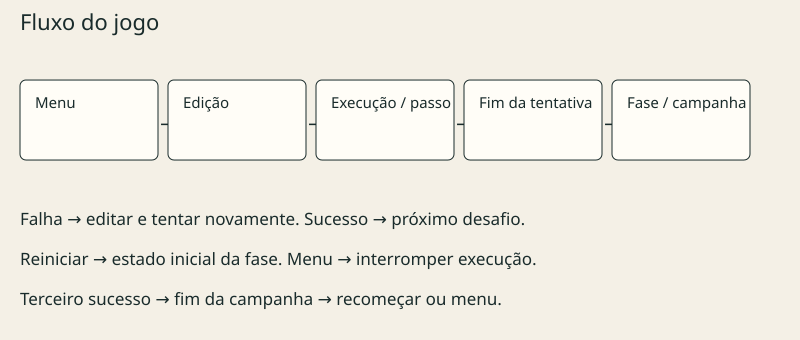

Menu oferece começar/continuar, missões e opções, versão/progresso. Reinício de campanha existente exige confirmação. Missões são liberadas em ordem; entrar abre editor/arena. Erro mantém tentativa. Regra aprovada nas missões 1–5 oferece próxima/replay. No final, abas permitem editar cinco fontes; testar projeto precede pilotar e vencer para exportar.

Ajuda/casos em diálogos com Escape e retorno de foco. Opções: texto maior, movimento reduzido, reset confirmado. Pausa/retomada no player; voltar à campanha encerra execução. Vitória disponibiliza conquista/download, sem etapa de questionário.

## 7. Level design

Seis mapas são desenhos de projeto gerados do conteúdo versionado, não screenshots. Arena, nave, entradas pelo topo, trajetória vertical e funções/casos definem o espaço. Posições 40/120/200 exemplificam onda inicial; mapas não representam todos os frames ou única solução. JSON contém entradas/resultados/fontes iniciais/referências.

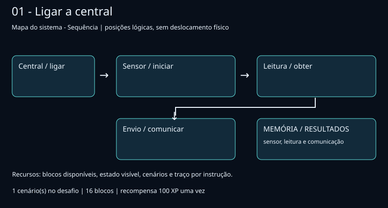

Controle invertido; ausência/simultaneidade de teclas distinguem regra geral de dois exemplos.

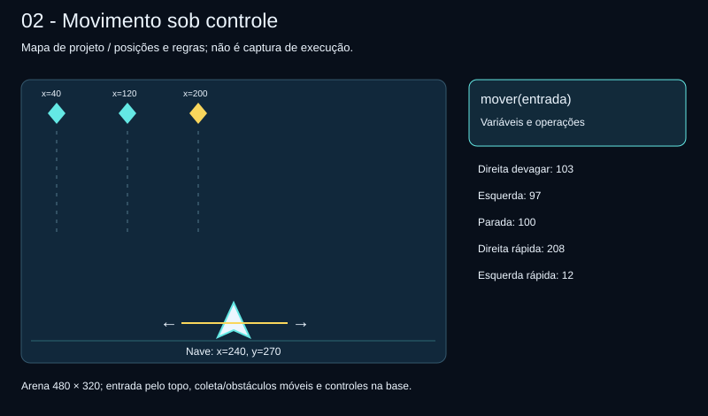

Deslocamento horizontal depende de posição, direção e velocidade; parada e velocidades diferentes impedem solução com distância fixa.

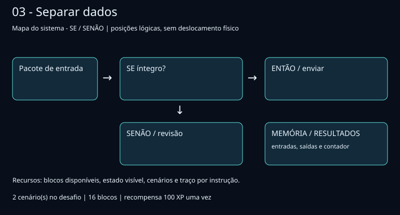

Raio indica limite de coleta/dano; fronteira exige igualdade. Anel é explicação de projeto, não elemento obrigatório do HUD.

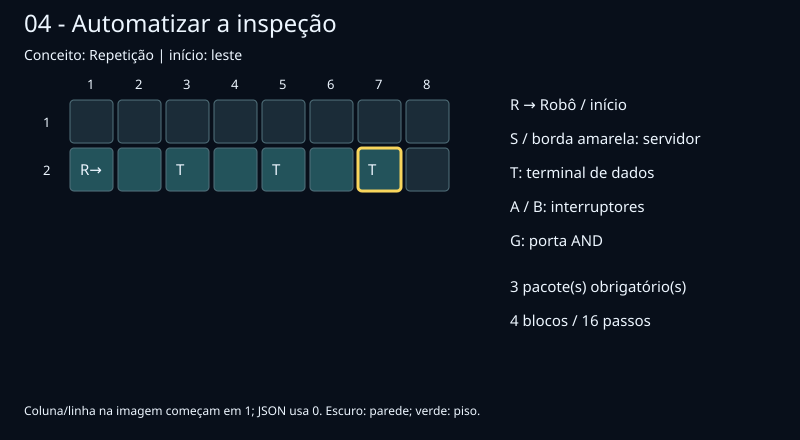

Cristais/estrelas alteram estado acumulado; outros conservam total. Redefinir pontos a cada objeto falha.

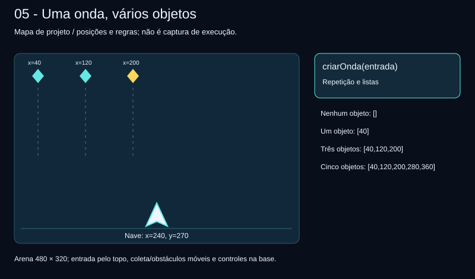

Repetição cria lista de posições espaçadas. Quantidade zero e 1/3/5 revelam objeto extra.

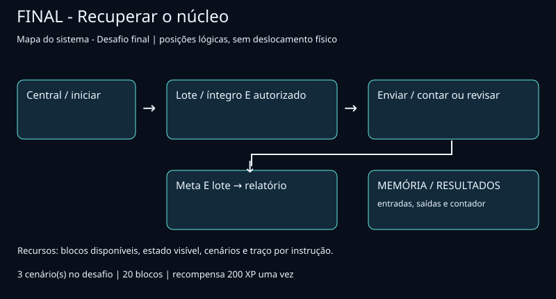

Cinco fontes salvas comandam cenário; composição de regras e pilotagem entre recompensas/pedras elevam desafio. Schema/semântica exigem seis missões na ordem, contratos/casos coerentes, referência que passa e fonte inicial que falha. JSON inválido bloqueia build; referência não preenche editor automaticamente.

## 8. Interface do usuário — UI/UX

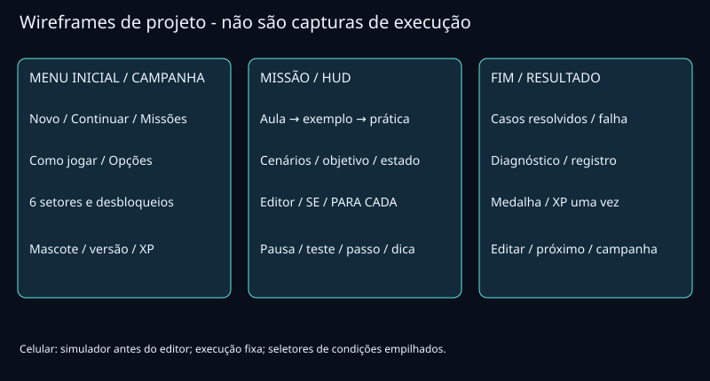

Paleta aprovada azul escuro/ciano/amarelo. Um objetivo, arena/HUD e editor; informação complementar sob demanda. HUD exibe pontos, vidas e estado real; animação mostra efeito do código. Editor mantém foco enquanto arena atualiza. Mensagens distinguem sintaxe, casos e resultado. Controles não são recriados por frame.

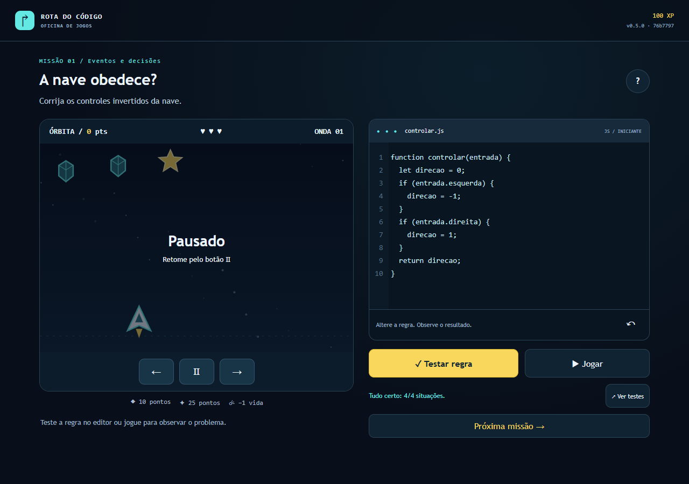

Captura real Chrome/Playwright, 09/10/2026, fonte 76b7797, build 0.5.0; não representa produção/playtest humano. O jogador altera valores da função e observa controles.

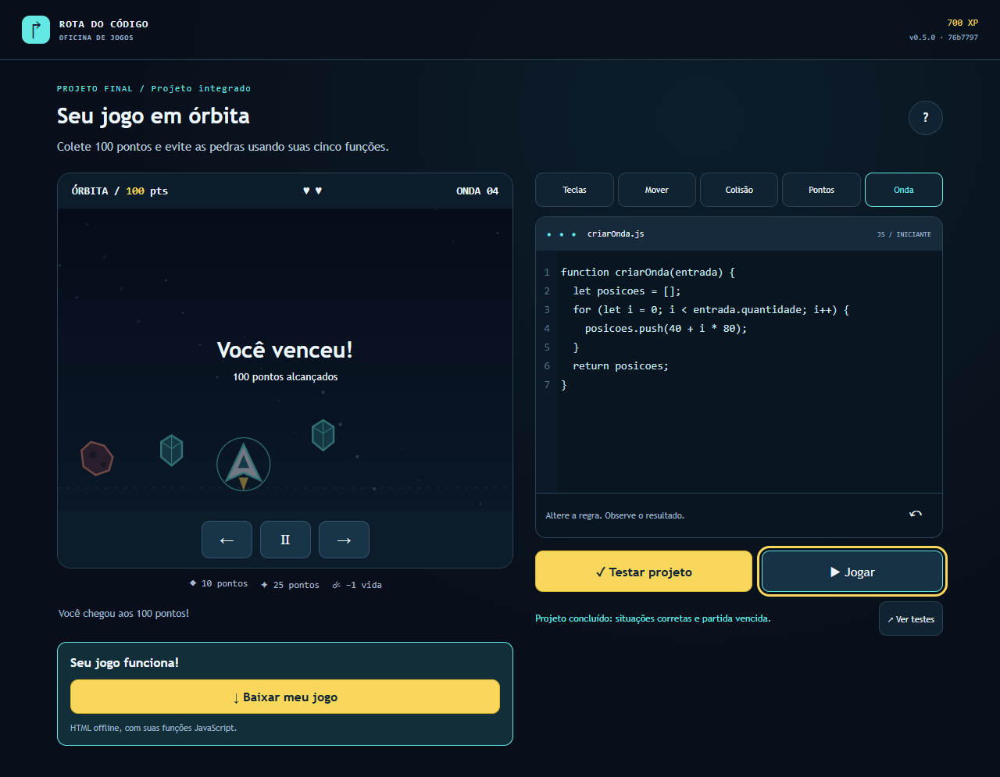

Mesma fonte/data: campanha pelo editor e partida pilotada pelos controles em teste automatizado, sem injetar progresso. Resultado de execução local.

Setas ou A/D pilotam fora do editor; toque usa botões de direção. Textarea nativo com numeração sincronizada. Foco visível, link para conteúdo, rótulos, texto/ícones além da cor, anúncios de eventos relevantes, sem anunciar cada frame. Blur limpa teclas; página oculta pausa. Texto maior/movimento reduzido ajustam preferências; objetos necessários ao gameplay continuam se movendo.

Em 390×844, arena/editor empilhados sem overflow horizontal nos testes; código longo rola dentro do campo. Jogar revela arena no celular. Alvos principais ≥44px, toque 48px. Testes de pausa/erros/menus/foco/campanha/toque/persistência/offline não certificam todos os aparelhos ou acessibilidade completa. P05: playtest por colegas de outra turma e revisão de clareza ainda pendentes.

## 9. Áudio e música

Ausência de trilha/efeitos/controle de volume. Feedback visual/textual. Áudio futuro exige origem/licença, controle e alternativa textual por PR.

## 10. Arte e referências visuais

Mascote/nave/objetos/ícones/mapas/wireframes/concept SVG/CSS originais, criados com assistência do Codex. PNGs são capturas reais. Fontes Trebuchet MS/Consolas e alternativas locais, sem distribuição de arquivos de fonte ou CDN. Sem ativos copiados de jogos/modelo Word.

Referência de interação: relação direta entre código e resultado de um pequeno jogo. Não reproduz outro título nem declara eficácia educativa por referência. Versões anteriores/fontes consultadas permanecem no histórico; não descrevem mecânica ativa.

Referências técnicas: [esbuild](https://esbuild.github.io/api/#format), [Vitest](https://vitest.dev/guide/), [Playwright](https://playwright.dev/docs/test-assertions), [ambientes GitHub](https://docs.github.com/en/actions/how-tos/deploy/configure-and-manage-deployments/manage-environments) e [GitHub Pages](https://docs.github.com/en/pages/getting-started-with-github-pages/configuring-a-publishing-source-for-your-github-pages-site). Licenças/versões no lockfile/THIRD_PARTY/SBOM.

## 11. IA e componentes de terceiros

| Ferramenta / componente | Uso efetivo | Licença / condição |
|---|---|---|
| Codex | Requisitos/concepção/código/conteúdo/testes/arte vetorial/documentação | AI-USAGE; revisão por outro humano antes do merge pendente |
| TypeScript / esbuild | Tipos/empacotamento | Apache-2.0 / MIT |
| Ajv / Vitest / Playwright | Schema/regras/navegador | MIT / MIT / Apache-2.0 |
| Markdown-it / fflate | GDD/ZIP | MIT / MIT |
| ESLint / typescript-eslint / tsx | Lint/validação | MIT conforme inventário |

Transitividade/versões no THIRD_PARTY/lockfile/SBOM. Nenhuma dependência nova. Sem Opal, AI Studio, Stitch, raster ou IA em runtime; golden eval dessas ferramentas não se aplica ao uso realizado. Testes de comparação com JavaScript nativo usam somente fontes editoriais confiáveis em Node VM com timeout, nunca código do jogador dessa maneira no aplicativo.

Declaração de originalidade/direitos: desenvolvido para a atividade com assistência de IA registrada e licenças identificadas; HTML exportado inclui MIT completo. Confirmação coletiva/revisão humana de conteúdo/direitos pendentes. Sem assinaturas/consentimentos/aprovações fictícias. Entrega da UC não autoriza inscrição ou aceite do concurso opcional.

## 12. Ideias adicionais e próximos passos

Implementado na candidata 0.5.0: cinco missões JavaScript/final, editor limitado/diagnósticos, testes públicos, minijogo real, menus/pausa/opções, 700 XP, fontes/vitórias persistentes, HTML exportável. Evidências locais em docs/evidencias/oficina-jogos.md. Uma campanha ativa; versões anteriores recuperáveis no Git.

Restam revisão/participação dos quatro, playtest educativo/acessibilidade humana, HML/PRD, recuperação/sondas/DORA medidos, vídeo, triagem e relatório. Novas funções, editor mais amplo, níveis e áudio são futuro. Não há resultados educativos/produção/colaboração simulados. GDD atualizado por PR quando mecânica muda.

## Esteira

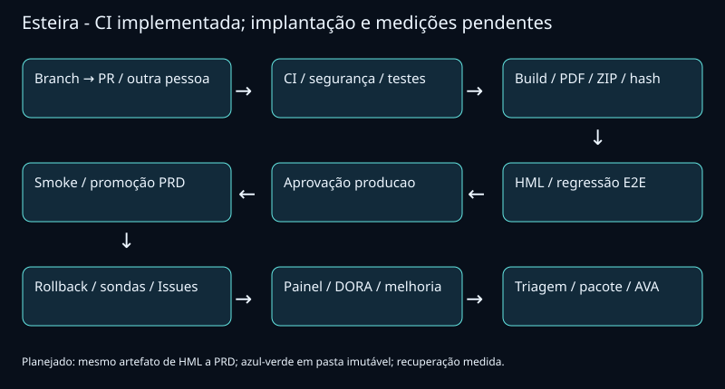

Repositório: https://github.com/luccalck/desafio-arcade . GitHub Flow/Conventional Commits, main protegida, PR com ci/revisão por outra pessoa. Actions push/PR: ubuntu-latest/npm ci/lockfile, lint, unidade/integração/conteúdo, E2E, Gitleaks, audit produção, SBOM, reprodutibilidade, GDD/pdfinfo/texto, ZIP/checksum/artefatos. Mapas regenerados ao converter GDD. CI não comprova implantação ou revisão humana.

Planejado: gh-pages escrito apenas pela pipeline, /hml/, /releases/<sha>/ imutáveis, loader/rollout, mesmo ZIP até produção. Azul-verde: validar nova pasta, aprovação registrada em producao, promover ponteiro, smoke, recuperação automática/manual. Sessão deve manter versão válida. Recuperação <5 minutos incluindo Pages exige ensaio real, ainda não realizado.

Sondas HTTP/latência/versão a cada 15 minutos, CSV, Issues JogoForaDoAr/LatenciaAlta, fechamento automático, /status/ e quatro DORA reais com comparação ao lead time de 11 dias/melhoria medida permanecem pendentes. Cron pode atrasar; demonstração exige execução observável.

Pipeline da tag final: submissao/GDD.pdf, LINK_DO_JOGO.txt, build.zip com LEIA-ME, pitch.mp4 humano e MANIFESTO.sha256, seguidos de triagem real. Vídeo de produção entra antes da tag final; relatório recebe evidências depois de release/triagem. Data/versão/identificação/URLs reconciliadas com release real. Prazo 09/10/2026 até início da aula, horário não confirmado; prévia não retroagida. Nenhum aceite de publicação/pacote/nota/banca declarado nesta candidata.
