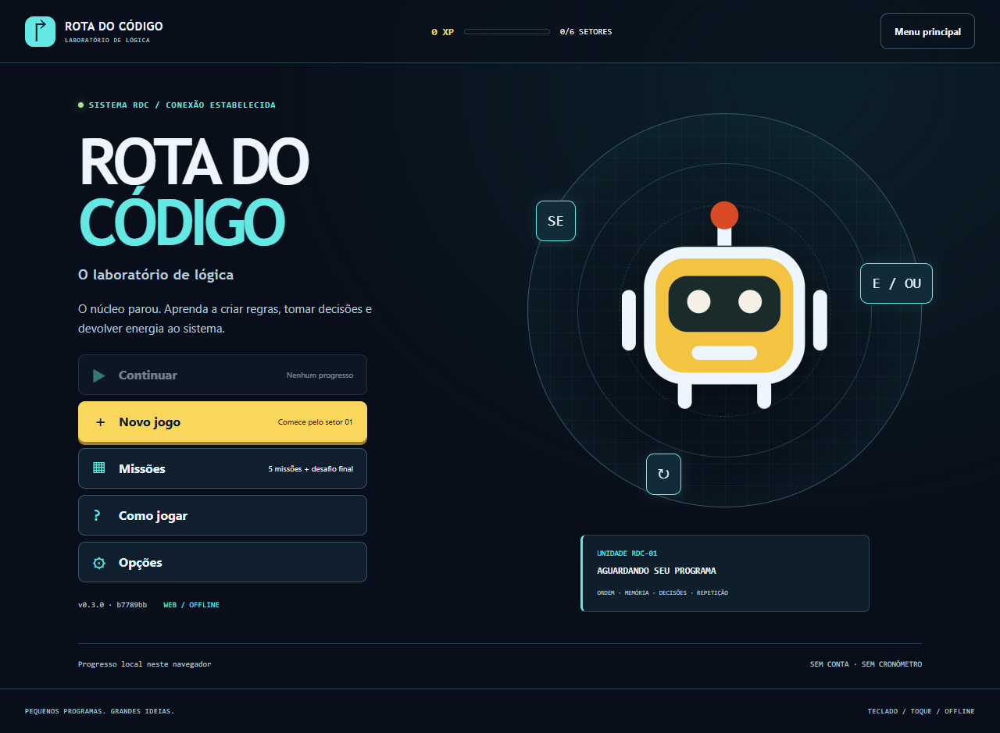

# Rota do Código - Game Design Document

Versão de projeto: **{{VERSION}}**. Data: **07/10/2026**. Evolução do laboratório de lógica integralmente aprovada pelo responsável: “Sim, eu aprovo tudo”. Documento da branch candidata, ainda sem release ou publicação em produção.

| Identificação | Situação verdadeira |
|---|---|
| Jogo / atividade | Rota do Código / Desafio Arcade - Integração e Entrega Contínua, DevOps |
| Squad, quatro integrantes, nomes, RAs e papéis | Identificação será fornecida pelo responsável; ainda incompleta |
| Repositório | https://github.com/luccalck/desafio-arcade |
| PR candidato | https://github.com/luccalck/desafio-arcade/pull/2 |
| Produção / homologação / vídeo | Ainda não publicados ou gravados |
| Plataforma | WEB estática responsiva, a mesma experiência em computador e celular |

A aprovação de concepção não é revisão de PR por outro integrante. CPF/assinaturas não integram esta versão pública; eventual documento privado será confirmado com o professor. Identificação, revisão humana e links de release permanecem pendentes. As capturas locais não são evidências de produção ou playtest humano.

## 1. Premissa e problema endereçado

O problema educativo é a dificuldade inicial de relacionar instruções, valores e decisões ao comportamento de um sistema digital. Público: iniciantes em tecnologia com leitura básica em português, sem necessidade de conhecer uma linguagem de programação. Acesso pelo navegador ou build offline, sem cadastro ou engine instalada.

O jogador constrói regras em cinco missões e um desafio integrado. Ações observáveis permitem ordenar por dependência, acompanhar uma variável, tratar dois caminhos, combinar condições e generalizar para lotes diferentes. Aula curta, exemplo por passo e prática guiada antecedem o desafio independente. Medalhas/XP sinalizam conclusão, não uma medida de conhecimento. Tentativas ilimitadas e ausência de cronômetro permitem corrigir e explorar. A hipótese educativa ainda precisa de playtest humano; não foi medido ganho de aprendizagem ou diversão.

## 2. High concept

Rota do Código é um puzzle educativo web em que o jogador recupera um laboratório digital criando programas com blocos em português. Cinco missões apresentam sequência, variáveis, SE/SENÃO, E/OU e PARA CADA; um desafio final reúne essas ferramentas. Cada missão começa com uma explicação curta, um exemplo interativo e uma prática sem XP. No desafio, o mesmo programa precisa resolver novas entradas, enquanto a interface mostra valores, decisões e saídas por instrução. Falhas têm diagnóstico e permitem editar. Menus, seis setores, medalhas e até 700 XP organizam a campanha, com teclado, toque e execução offline. O diferencial é aplicar raciocínio em regras de sistemas, com efeitos visíveis e cenários diferentes, sem exigir sintaxe de uma linguagem.

## 3. Gênero e plataforma

Puzzle educativo de programação por blocos, com simuladores de sistemas digitais. Destino obrigatório **WEB**, estático e responsivo. Não há aplicativo nativo, APK ou instalação de engine para jogar.

TypeScript/core puro, HTML/CSS/SVG e esbuild IIFE, sem React ou engine de física. Ajv valida conteúdo, Vitest testa regras/integração e Playwright testa o navegador. Node 24/lockfile são ferramentas de desenvolvimento/CI; o jogador descompacta o ZIP e abre index.html. Dados incorporados ao script, fontes do sistema e ausência de chamadas remotas permitem file:// offline. A stack existente foi mantida para concentrar esforço nas regras e na esteira.

## 4. Mecânicas-core

O programa é uma lista de blocos: ações, **SE/ENTÃO/SENÃO** e **PARA CADA pacote**. Predicados são perguntas definidas pelo jogo; E/OU combinam condições com agrupamento visível. Não há código arbitrário, eval, repetição infinita, laço dentro de laço ou entrada de linguagem textual. Ramos contêm ações; PARA CADA pode conter ações e SE. Limites: até oito pacotes e cem operações por cenário, com 16 blocos por missão e 20 no final. Ramos e grupos contam no orçamento.

Loop de aprendizagem: aula de três cartões → exemplo interativo → prática guiada → desafio independente → diagnóstico/recompensa. A prática começa com ajuda e, em algumas missões, programa parcial; não concede XP. O desafio começa sem esse programa. Exemplos usam dados distintos e alguns usam regras mais simples, que não bastam para os cenários do desafio.

O jogador adiciona/remove/reordena blocos, escolhe condições/conectores e acrescenta ações aos ramos. Testar programa executa os cenários em sequência; Um passo mostra uma instrução. Estado, ramo, pacote atual e valores antes/depois são observáveis; o registro preserva a causa de uma falha. Parar interrompe execução; pausa conserva estado para retomar. Rever a aula preserva o programa. Falha encerra a tentativa com programa editável; reiniciar restaura o início da etapa.

| Missão | Ação que demonstra o conceito | Objetivo / cenários |
|---|---|---|
| 1 - Ligar a central | Ordenar ligar → iniciar sensor → ler → enviar | Enviar leitura obtida com dependências atendidas; 1 cenário |
| 2 - Memória do sistema | Carregar/processar e observar energia antes/depois | Duas operações, uma carga disponível e energia final 1; entradas iniciais 2/+3 e 1/+4, custo 2 |
| 3 - Separar dados | Criar SE íntegro → enviar, SENÃO → revisão | Mesma regra trata 1 pacote íntegro e 1 corrompido em dois cenários |
| 4 - Autorizar o acesso | Combinar (credencial E energia≥3) OU manutenção | Conceder/negar corretamente em seis situações; casos só credencial, só energia e manutenção distinguem os conectores |
| 5 - Processar um lote | PARA CADA com classificação e contador inicializado | Lotes de 3/5, enviados 2/3; contar apenas após enviar, uma vez por item |
| Final - Recuperar o núcleo | Inicialização, classificação com E, contador, loop e decisão final | Lotes com metas 1/3/0; todos devem funcionar; relatório só com meta atingida E lote concluído |

Na missão 2, energia é um inteiro: carregar soma o valor informado, processar subtrai o custo e exige saldo naquele momento. O exemplo permite operar antes da carga, mas a entrada de energia 1 do desafio exige outra ordem. Uma carga e duas operações são limites explícitos. Temperatura 24°C na missão 1 é um valor fictício do simulador, não telemetria real.

Dados íntegros e autorizados são atributos informados de cada pacote. No final, os demais vão para revisão. O contador precisa ser inicializado e soma apenas após um envio, sem duplicação. Além dos três lotes, a condição de liberação é verificada nas quatro combinações de meta/lote: deve negar quando uma delas faltar. Uma liberação incondicional ou um OU permissivo não comprova a decisão solicitada.

Vitória exige todos os objetivos e cenários da etapa. Ações fora de contexto, dependência ausente, energia insuficiente, encaminhamento errado, contador incorreto, decisão equivocada ou orçamento excedido geram falha explicada. Não há vidas, tempo limite ou monetização. Dicas progressivas orientam sem preencher automaticamente a solução.

Cada primeira conclusão de desafio concede 100 XP nas cinco missões e 200 XP no final, total 700, mais medalha/desbloqueio. Replay não duplica XP. Progresso usa IDs novos/version 2 e chave própria; vitórias da campanha antiga de rotas não são convertidas em domínio de lógica. O registro antigo é preservado e a interface informa a mudança quando o encontra. Armazenamento indisponível mantém sessão em memória; reset confirmado remove apenas a chave da campanha nova. Sem dados pessoais, ranking ou telemetria de partidas.

## 5. Enredo e personagens

O núcleo de um laboratório digital parou. O jogador recupera seis setores programando central, memória, dados, acesso e processamento. O robô original RDC-01 é mascote/operador e acompanha feedback; deslocamento no mapa não é a tarefa principal da nova campanha. Narrativa abstrata, sem pretensão de simular hardware ou permissões de um sistema real. Combate, adversários, biografia extensa e storyboard narrativo não se aplicam a esta versão.

## 6. Fluxo do jogo

Menu inicial: Novo jogo/Continuar, Missões, Como jogar e Opções. Continuar depende de progresso; Novo jogo confirma reinício quando necessário. Campanha contém cinco setores e núcleo final, liberados em sequência. Cada missão percorre aula → exemplo → prática → desafio. Exemplo é executado antes de praticar; prática completa libera o desafio. Resultado de falha permite editar; vitória avança ou revisita. Sexta vitória abre encerramento com seis medalhas.

Pausa oferece retomar, rever aula, reiniciar tentativa, opções ou campanha. Opções ajustam texto maior/movimento reduzido e reset confirmado. Escape fecha/cancela o diálogo. Voltar à campanha interrompe execução; rever aula conserva programa. Menu permanece uma interface de jogo, com mascote e painel de setores, mantendo a paleta aprovada.

## 7. Level design

O gênero usa mapas de sistemas, com posições de entrada, processamento, memória e saídas, em vez de percursos físicos. Diagramas abaixo são mapas de projeto gerados a partir das seis missões versionadas. Não são capturas de execução. A posição visual dos componentes orienta o fluxo; pacote, variável e regra são recursos efetivamente manipulados pelo programa.

Central/sensor/leitura/envio: dependências formam uma sequência. Iniciar sem ligar, ler sem iniciar ou enviar sem leitura falham. O exemplo e a prática mostram estados; desafio começa vazio.

Energia inicial entra na memória. Carga soma, operações subtraem e o painel mostra valores. O mesmo programa precisa servir às entradas 2/+3 e 1/+4. Duas operações de custo 2 terminam em 1.

Entrada de pacote, teste de integridade e duas portas de saída. Cada cenário tem um item; o ramo verdadeiro envia e o falso separa. A interface identifica atributo e encaminhamento, tornando ambos os casos observáveis.

Entradas: credencial válida, energia suficiente e manutenção autorizada. Grupo E representa acesso normal; OU representa alternativa de manutenção. Seis cartões de cenário podem ser inspecionados. Os testes de unidade também verificam as oito combinações booleanas.

Coleção na entrada, grupo PARA CADA no programa, classificação e portas enviar/revisão. Contador começa em 0 e aumenta após envios. Lotes 3/5 exigem generalizar o grupo, não copiar instruções por item.

Central e contador precedem o lote. Classificação exige integridade E permissão; somente enviados são contados. Depois, decisão protege o relatório. Cenários com 3/5/2 pacotes têm metas 1/3/0; metas correspondem aos dados. O caso sem enviados verifica inicialização e tratamento do zero.

JSON/schema/semântica exigem ordem dos seis conceitos, IDs únicos, objetos de pacote válidos, contagens/metas coerentes, lotes limitados e soluções que vencem em todos os cenários/práticas. Exemplos também são executados pelo validador. Conteúdo desconhecido ou solução incoerente interrompe a build. Soluções editoriais são contratos de teste; o desafio não possui botão de preenchimento automático.

## 8. Interface do usuário - UI/UX

Azul escuro para laboratório, ciano para lógica/conexões e amarelo para ação/conquista. Menu inicial com botões claros e mascote; campanha com setores conectados; aula em três cartões com metáfora e exemplo; simulador com estados/entradas; editor com agrupamento E/OU, ramos e corpo de repetição. Resultado explica causa ou conceito e apresenta cenários resolvidos e próxima ação.

Captura real: 07/10/2026, Chrome/Playwright local, fonte b7789bb. Os relatórios/screenshots incluem também aula, variáveis, E/OU, repetição e final/celular. Não representar essas imagens como produção ou teste com pessoa. Wireframes/concept/mapas são documentação de projeto.

Controles HTML por clique, toque e teclado; nenhum arrastar obrigatório. Botões/seletores têm área de interação de pelo menos 44 px; foco visível e restauração após edição/remover último bloco (regressão do bug real #1). Textos e ícones acompanham cores; feedback textual com estado vivo, dicas e traço. Opções de texto maior e movimento reduzido; preferência do sistema respeitada. Sem áudio necessário.

Celular empilha simulador antes do editor, mantém controles fixos de execução/pausa e revela o simulador ao executar. Condições são empilhadas para não cortar os nomes. E2E verifica campanha inteira no viewport 390×844 sem overflow, com grupos/ramos/final, além de menus/teclado/pausa/persistência/offline. Isso não certifica acessibilidade nem todos os dispositivos. Stitch ainda não foi utilizado. Playtest por colega de outra turma e revisão de clareza seguem pendentes em P05.

## 9. Áudio e música

Não há áudio, música ou efeitos sonoros nesta versão, nem ativos de som ou controles sem função para volume. Instruções/feedback são visuais e textuais. Áudio futuro exige origem, licença, volume e alternativa textual registrados por PR.

## 10. Arte e referências visuais

Mascote, circuitos, painéis, mapas de sistemas, wireframes, concept e diagramas foram criados para o projeto em SVG/CSS com assistência do Codex. Capturas PNG vêm da aplicação real. Fontes do sistema, sem distribuir fontes externas ou CDN. Não foram incorporados personagens/marcas/imagens do modelo Word.

Referências técnicas: [esbuild IIFE](https://esbuild.github.io/api/#format), [Vitest](https://vitest.dev/guide/), [Playwright assertions](https://playwright.dev/docs/test-assertions), [ambientes GitHub](https://docs.github.com/en/actions/how-tos/deploy/configure-and-manage-deployments/manage-environments) e [GitHub Pages](https://docs.github.com/en/pages/getting-started-with-github-pages/configuring-a-publishing-source-for-your-github-pages-site). Informam escolhas de construção, sem arte/texto copiado ao jogo. Licenças/autores/versões no inventário THIRD_PARTY, lockfile e SBOM.

## 11. IA e componentes de terceiros

| Ferramenta / componente | Uso efetivo | Licença / condição |
|---|---|---|
| Codex | Requisitos, concepção aprovada, conteúdo, interpretador, menus, testes, SVG e documentação | AI-USAGE; revisão por outro humano pendente antes do merge |
| TypeScript / esbuild | Tipos e empacotamento | Apache-2.0 / MIT |
| Ajv / Vitest / Playwright | Schema, regras e navegador | MIT / MIT / Apache-2.0 |
| Markdown-it / fflate | GDD e ZIP | MIT / MIT |
| ESLint / typescript-eslint / tsx | Lint e validação | MIT conforme inventário |

Versões e transitivas no lockfile/THIRD_PARTY/SBOM. Nenhuma dependência nova foi necessária para a campanha de lógica. Não houve Opal, AI Studio, Stitch ou gerador raster. Não há API IA em runtime, backend, cadastro, dado pessoal do jogador ou serviço pago exigido. O uso de Codex não dispensa revisão humana de conteúdo e direitos.

Declaração de originalidade/direitos: projeto concebido para este trabalho com assistência de IA explicitada e licenças identificadas. Confirmação coletiva e revisão do squad ainda não registradas. Não há assinatura, aprovação fictícia ou aceite dos termos do concurso opcional; a entrega da UC não é inscrição no concurso.

## 12. Ideias adicionais e próximos passos

Implementado na branch candidata 0.3.0: cinco missões e final, aulas/exemplos/prática/desafio, interpretador de ações/variáveis/condições/repetição, menus/pausa/opções, cenários e traço, medalhas/700 XP, persistência com fallback e build WEB offline. Evidências em docs/evidencias/laboratorio-logica.md; não equivalem a estudo educativo ou produção.

Prioridades restantes: revisão/participação real dos quatro, HML/PRD, recuperação/sondas/DORA medidos, playtest, vídeo humano legendado, triagem e relatório técnico. Novas missões, expressões livres, áudio e personalização são futuro, fora desta build. O GDD é atualizado por PR quando a mecânica muda. A mudança aprovada substituiu a campanha de rotas; versões anteriores continuam recuperáveis no histórico Git, sem duas campanhas concorrentes na interface.

## Esteira

Repositório: https://github.com/luccalck/desafio-arcade . GitHub Flow/Conventional Commits, main protegida e PR com outra pessoa/check ci. Actions push/PR usa ubuntu-latest/npm ci/lockfile, lint, unidade/integração/conteúdo, E2E, Gitleaks, audit produção, SBOM, reprodutibilidade, GDD/pdfinfo/texto, ZIP/checksum e artefatos. Mapas são regenerados automaticamente ao converter o GDD. CI implementada não comprova implantação ou revisão humana.

Planejado: gh-pages escrito apenas pela pipeline, /hml/, /releases/<sha>/ imutáveis, loader/rollout e mesmo ZIP até produção. Azul-verde: validar nova pasta, registrar aprovação em producao, promover estavel, smoke e recuperar ponteiro se falhar. Sessão mantém versão enquanto válida; rollback retira seleção inválida. Responsável/motivo registrados. Recuperação abaixo de cinco minutos incluindo Pages exige ensaio real, não estimativa.

Sondas HTTP/latência/versão a cada 15 min, CSV em observabilidade, Issues JogoForaDoAr/LatenciaAlta, fechamento automático e /status/. DORA real conforme enunciado e comparação com lead time de 11 dias/melhoria medida. Cron pode atrasar; ensaio usa smoke/workflow ativo. Componentes/execuções permanecem pendentes.

Pipeline da tag final deve produzir submissao/GDD.pdf, LINK_DO_JOGO.txt, build.zip com LEIA-ME, pitch.mp4 humano e MANIFESTO.sha256, seguidos de triagem real. Vídeo de produção é entrada anterior ao fechamento; relatório recebe evidências finais de release/triagem depois. Versão/data/identificação/URLs devem corresponder à release real. Nenhum aceite de publicação/pacote/banca é declarado concluído nesta candidata.
