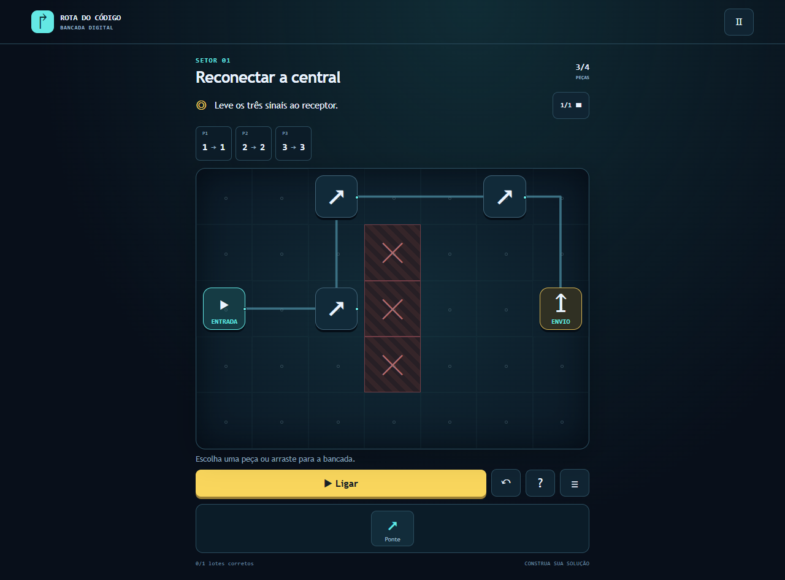
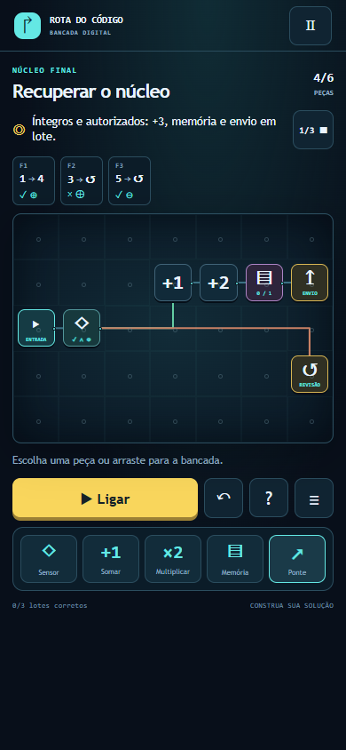

# Rota do Código - Game Design Document

Versão de projeto: **{{VERSION}}**. Data: **07/10/2026**. Bancada visual aprovada pelo responsável com “Sim”. Documento da branch candidata, sem release ou publicação em produção.

| Identificação | Situação verdadeira |
|---|---|
| Jogo / atividade | Rota do Código / Desafio Arcade - Integração e Entrega Contínua, DevOps |
| Squad, quatro integrantes, nomes, RAs e papéis | Identificação será fornecida pelo responsável; ainda incompleta |
| Repositório | https://github.com/luccalck/desafio-arcade |
| PR candidato | https://github.com/luccalck/desafio-arcade/pull/2 |
| Produção / homologação / vídeo | Ainda não publicados ou gravados |
| Plataforma | WEB estática responsiva; mesma experiência no computador e celular |

A aprovação de concepção não substitui a revisão do PR por outro integrante. CPF/assinaturas não integram a versão pública; eventual documento privado será confirmado com o professor. Identificação, revisão coletiva e links de release continuam pendentes. Capturas locais não são evidências de produção ou playtest humano.

## 1. Premissa e problema endereçado

O problema educativo é a dificuldade inicial de relacionar dados, transformação, condições e memória ao comportamento de um sistema digital. Público: iniciantes com leitura básica em português, sem conhecimento de sintaxe de programação. Acesso pelo navegador ou build offline, sem conta ou engine instalada.

O jogador constrói máquinas de dados em cinco missões e um desafio integrado. Peças, cabos e pacotes tornam observáveis as consequências das escolhas. Entradas diferentes exigem uma regra que generalize, em vez de repetir um roteiro. Tentativas ilimitadas e ausência de cronômetro permitem experimentar e corrigir. A ajuda oferece explicação direta e diagrama quando solicitada. Medalhas e XP sinalizam progresso; não medem conhecimento. Aprendizagem e diversão ainda precisam de playtest humano; nenhum ganho educativo foi medido.

## 2. High concept

Rota do Código é um puzzle educativo web em que o jogador recupera um laboratório montando máquinas de dados numa bancada visual. Em cinco missões, conecta peças, transforma números, separa pacotes, combina condições e guarda lotes em memória; o núcleo final reúne essas habilidades. Os dados percorrem cabos e mostram o efeito da montagem. Uma máquina deve resolver todas as entradas públicas, com limites de peças e mais de uma solução válida. Erros destacam a peça ou saída e preservam a tentativa para correção. Ajuda, configuração e registro aparecem sob demanda. Menus, seis setores, medalhas e até 700 XP organizam a campanha, com arraste ou clique, toque e teclado, sem instalação para jogar. O diferencial é construir e depurar um sistema visual, aprendendo lógica por causa e efeito, sem sintaxe obrigatória.

## 3. Gênero e plataforma

Puzzle educativo de construção de circuitos e processamento de dados. Destino obrigatório **WEB**, estático e responsivo. Não há APK, aplicativo nativo ou instalação de engine para jogar.

TypeScript/core puro, HTML/CSS/SVG e esbuild IIFE, sem React ou engine física. Ajv valida conteúdo, Vitest testa regras/integração e Playwright testa navegador. Node 24 e lockfile são ferramentas de desenvolvimento/CI. O jogador descompacta o ZIP e abre index.html; dados incorporados ao script e fontes do sistema permitem file:// offline, sem chamadas remotas. A stack existente foi mantida para concentrar esforço nas regras e na esteira; nenhuma dependência nova foi necessária.

## 4. Mecânicas-core

A bancada tem 7 × 5 encaixes. Entrada e receptores são fixos. O jogador coloca pontes, somadores, multiplicadores, sensores e buffers conforme a missão, move peças, configura parâmetros e liga saídas a destinos. Arrastar é opcional: selecionar peça/porta e depois encaixe/destino funciona por clique, toque ou teclado. Girar altera a orientação visual; preserva regra e conexões. Desfazer conserva até 50 montagens anteriores da sessão. Remover uma peça remove seus cabos.

O cabo usa um trajeto ortogonal válido dentro do alcance informado, evitando encaixes danificados. Cruzamentos não criam junções. Cada saída admite um cabo; sensores escolhem SIM/NÃO. Somadores permitem +1 ou +2 e multiplicadores ×2. Configuração de sensor permite predicados, E/OU, agrupamento e inversão conforme os recursos da missão. Não há código arbitrário, eval, rede ou ciclos no grafo. Conteúdo limita lotes a dez pacotes; o simulador limita execução a 512 eventos e valores a 0..999.

Loop: montar → ligar → observar → corrigir → resolver todos os lotes → recompensa/próxima missão. Não há aula, exemplo ou prática obrigatória. Ajuda, lotes públicos e registro podem ser abertos quando necessários. Ligar executa os casos em sequência, usando a mesma montagem. Pausa conserva estado; uma edição interrompe o ensaio e prepara nova execução. Falha conserva a montagem e destaca o ponto/valor relevante. Pontes retransmitem; sensores classificam; buffers guardam e contam, liberando somente após encerrar o processamento de entrada.

| Missão | Aprendizagem por ação | Casos / recursos |
|---|---|---|
| 1 - Reconectar a central | Planejar conexões e percurso sob restrições | Três sinais inalterados; parede e alcance 3; orçamento 4 pontes; duas rotas editoriais |
| 2 - Calibrar sinais | Compor transformações e generalizar | 1/3/5 devem virar 4/6/8; 2/4 devem virar 5/7; duas peças; +1/+2/×2 |
| 3 - Separar dados | Tomar decisão por atributo | Lotes de 4 e 3; íntegros ao envio, corrompidos à revisão; três peças |
| 4 - Controlar acesso | Combinar alternativas e condições | Oito combinações: (credencial E energia) OU manutenção; três peças |
| 5 - Gerenciar o buffer | Guardar e contar antes de liberar | Lotes de 4/5/2; metas 2/3/0; íntegros aguardam em memória; três peças |
| Final - Recuperar o núcleo | Integrar classificação, valores e memória | Lotes de 3/5/2; metas 1/3/0; íntegros E autorizados recebem +3 e aguardam; seis peças |

Em Calibrar sinais, ×2 seguido de +2 acerta a entrada 1, mas erra 3 e 5. Isso torna insuficiente acertar um exemplo. Em Controlar acesso, a manutenção é uma alternativa ao par credencial/energia; todos os oito casos distinguem E de OU. Sensores mostram os atributos usados, sem depender apenas de cor.

Nas missões de memória, o receptor de envio recusa saída antes de fechar o lote. O buffer segura os pacotes aprovados, registra a contagem e libera após processar a entrada; rejeitados podem seguir diretamente à revisão. No final, rejeitados conservam o valor original; aprovados chegam com +3. O lote sem aprovados verifica o tratamento do zero. Não há botão manual obrigatório de liberação. Predicados de meta/lote estão disponíveis no final; a vitória verifica comportamento, não uma expressão ou montagem única.

Vitória exige conservar todos os pacotes, valores e destinos esperados em todos os casos, com contagem/memória quando exigidas. Cabo ausente ou inválido, saída incorreta, valor errado, repetição de pacote e limites excedidos produzem falha localizada. Não há vidas, tempo limite ou monetização. Duas soluções editoriais por missão passam no validador; outras montagens que satisfazem as mesmas regras também podem vencer. Não há botão de preenchimento automático.

Primeira conclusão: 100 XP por missão e 200 no final, total 700; replay não duplica. Estrelas opcionais comparam o número de peças usado com a menor das duas soluções editoriais: três até a referência, duas com uma peça adicional, uma acima disso. São incentivo de eficiência, sem bônus de XP ou afirmação de ótimo global. Progresso concluído usa chave própria rota-do-codigo:bench:v3. Campanhas antigas são preservadas sem desbloquear a nova; montagem/drafts são da sessão. Armazenamento indisponível mantém progresso em memória. Reset confirmado remove somente a nova campanha. Sem ranking, dados pessoais ou telemetria de partidas.

## 5. Enredo e personagens

O núcleo de um laboratório digital parou. O jogador recupera cinco setores e o núcleo final construindo máquinas de dados. O robô original RDC-01 é mascote e operador; o personagem não precisa andar para executar a regra. Narrativa abstrata, sem pretensão de simular hardware ou autenticação real. Combate, biografia extensa e storyboard narrativo não se aplicam à versão.

## 6. Fluxo do jogo

Menu inicial oferece Novo jogo, Continuar, Missões e Opções. Novo jogo confirma reinício quando há progresso. A campanha contém cinco setores e o final, liberados em sequência. Entrar numa missão abre diretamente a bancada. Ajuda e inspeção não são etapas obrigatórias. Resultado de vitória oferece replay, próxima missão ou campanha; sexto resultado encerra os seis setores. Erro permanece na bancada para editar.

Pausa permite retomar, reiniciar tentativa, opções ou missões. Opções ajustam texto maior/movimento reduzido e reset confirmado. Escape cancela seleção ou fecha diálogo. Sair interrompe execução. Menus mantêm mascote e setores com a paleta aprovada, sem acumular explicações na área principal.

## 7. Level design

Os mapas abaixo são desenhos de projeto derivados da primeira montagem editorial válida de cada missão versionada. Identificam posições de entrada, peças, receptores, obstáculos e cabos na grade. Não são capturas de execução nem a única solução aceita. Configurações completas e casos estão no JSON; o jogador tem os mesmos dados públicos pelo botão de lotes.

A parede central impede caminho direto. Pontes respeitam alcance de três casas. Rotas superior/inferior oferecem dois planos de conexão.

Somadores em série fazem +3 por composição de +1 e +2, cuja ordem pode variar. ×2 é uma alternativa que precisa ser testada contra todas as entradas; não basta o primeiro número.

Sensor de integridade divide o fluxo. Inverter a pergunta e trocar as portas conserva o resultado correto, oferecendo outra solução.

Um sensor agrupado pode representar (credencial E energia) OU manutenção. Outra montagem usa dois sensores e caminhos, distinguindo expressão e comportamento equivalente.

Sensor encaminha íntegros ao buffer e corrompidos à revisão. Memória ocupa espaço e só libera após fechar a entrada. Metas 2/3/0 mudam conforme o lote.

Classificação, duas somas e buffer formam uma máquina composta. A variante usa sensores em série. Lotes com aprovados e sem aprovados exigem que revisão não altere números e envio respeite memória.

JSON/schema/semântica exigem seis conceitos na ordem, IDs/pacotes válidos e únicos, metas/valores derivados dos dados, orçamento e regras de montagem. As duas soluções de cada missão são executadas em todos os casos durante validação; conteúdo inválido interrompe a build. Soluções editoriais são contratos, não critérios de igualdade com a tentativa do jogador.

## 8. Interface do usuário - UI/UX

Azul escuro para bancada, ciano para dados/conexões e amarelo para ação/conquista. Uma frase de objetivo, cartões de entrada, grade visual e controles de execução compõem a tela. Seleção substitui a bandeja por inspetor contextual; configuração, ajuda, lotes e registro aparecem em diálogos sob demanda. Pacotes percorrem cabos durante execução; nós/saídas com falha são destacados. Resultado mostra medalha, eficiência opcional e ação seguinte.

Captura real: 07/10/2026, Chrome/Playwright local, fonte 42678cd, build 0.4.0. Não representa produção ou playtest humano. Mapas, concept e wireframes são desenhos de projeto explicitamente identificados.

Controles HTML por clique/toque/teclado, com alternativa ao arraste; seleção de saída e destino realiza conexão. Setas navegam encaixes; Enter seleciona; Delete remove selecionado e Escape cancela. Foco visível, link para conteúdo e restauração ao remover a última peça (regressão do bug real #1). Ícones, textos e valores acompanham cores. Texto maior e movimento reduzido respeitam preferências; sem áudio necessário.

No viewport testado de 390×844, bancada e controles cabem sem overflow horizontal; alvos de encaixe/controles têm pelo menos 44 px nessa configuração. Desktop aproxima execução da mesa, podendo ter rolagem vertical. Testes de navegador verificam campanha completa por toque, teclado/foco, pausa, erros/correção, menus, persistência e offline. Isso não certifica acessibilidade ou todos os dispositivos. Playtest por colega de outra turma e revisão de clareza seguem pendentes em P05.

## 9. Áudio e música

Não há áudio, música ou efeitos sonoros, nem controle de volume sem função. Feedback é visual e textual. Áudio futuro exige origem, licença, volume e alternativa textual registrados por PR.

## 10. Arte e referências visuais

Mascote, bancada, ícones, cabos, mapas, wireframes e concept foram criados para o projeto em SVG/CSS com assistência do Codex. Capturas PNG vêm da aplicação real. Fontes locais do sistema, sem arquivos externos ou CDN. Não foram incorporadas imagens ou marcas dos jogos de referência ou do modelo Word.

Referências de interação consultadas: [Opus Magnum](https://www.zachtronics.com/opus-magnum/), [SpaceChem](https://zachtronics.com/spacechem/), [Human Resource Machine](https://tomorrowcorporation.com/humanresourcemachine) e [Zachademics](https://zachtronics.com/zachademics/). Informam construção, observação e correção de sistemas; não constituem evidência de eficácia desta implementação nem autorização para copiar ativos.

Referências técnicas: [esbuild IIFE](https://esbuild.github.io/api/#format), [Vitest](https://vitest.dev/guide/), [Playwright](https://playwright.dev/docs/test-assertions), [ambientes GitHub](https://docs.github.com/en/actions/how-tos/deploy/configure-and-manage-deployments/manage-environments) e [GitHub Pages](https://docs.github.com/en/pages/getting-started-with-github-pages/configuring-a-publishing-source-for-your-github-pages-site). Licenças/autores/versões no THIRD_PARTY, lockfile e SBOM.

## 11. IA e componentes de terceiros

| Ferramenta / componente | Uso efetivo | Licença / condição |
|---|---|---|
| Codex | Requisitos, concepção aprovada, regras, conteúdo, interface, testes, SVG e documentação | AI-USAGE; revisão por outro humano pendente antes do merge |
| TypeScript / esbuild | Tipos e empacotamento | Apache-2.0 / MIT |
| Ajv / Vitest / Playwright | Schema, regras e navegador | MIT / MIT / Apache-2.0 |
| Markdown-it / fflate | GDD e ZIP | MIT / MIT |
| ESLint / typescript-eslint / tsx | Lint e validação | MIT conforme inventário |

Versões/transitivas no lockfile/THIRD_PARTY/SBOM. Sem dependência nova para a bancada. Nenhum uso de Opal, AI Studio, Stitch ou gerador raster. Sem API IA em runtime, backend obrigatório, cadastro ou serviço pago. IA não dispensa revisão humana de conteúdo e direitos.

Declaração de originalidade/direitos: projeto concebido para o trabalho com assistência de IA explicitada e licenças identificadas. Confirmação coletiva e revisão do squad ainda não registradas. Sem assinatura/aprovação fictícia ou aceite do concurso opcional. A entrega da UC não é inscrição no concurso.

## 12. Ideias adicionais e próximos passos

Implementado na candidata 0.4.0: cinco missões e final, bancada de peças/cabos, simulador puro de dados/condições/memória, menus/pausa/opções, ajuda/log sob demanda, medalhas/700 XP, persistência de vitórias e build WEB offline. Evidências em docs/evidencias/bancada-visual.md. A fonte ativa tem uma única campanha; versões anteriores permanecem recuperáveis no Git.

Prioridades restantes: revisão e participação real dos quatro, playtest educativo, HML/PRD, recuperação/sondas/DORA medidos, vídeo humano legendado, triagem e relatório. Novas missões, áudio, personalização e expressão livre são futuro. GDD atualizado por PR quando mecânica muda. Não há resultados educativos, de produção ou de colaboração simulados.

## Esteira

Repositório: https://github.com/luccalck/desafio-arcade . GitHub Flow/Conventional Commits, main protegida e PR com revisão por outra pessoa/check ci. Actions push/PR usa ubuntu-latest/npm ci/lockfile, lint, unidade/integração/conteúdo, E2E, Gitleaks, audit produção, SBOM, reprodutibilidade, GDD/pdfinfo/texto, ZIP/checksum e artefatos. Mapas são regenerados automaticamente ao converter o GDD. CI não comprova implantação ou revisão humana.

Planejado: gh-pages escrito apenas pela pipeline, /hml/, /releases/<sha>/ imutáveis, loader/rollout e mesmo ZIP até produção. Azul-verde: validar nova pasta, registrar aprovação em producao, promover estável, smoke e recuperar ponteiro se falhar. Sessão mantém versão enquanto válida; rollback retira seleção inválida. Recuperação <5 minutos incluindo Pages exige ensaio real.

Sondas HTTP/latência/versão a cada 15 min, CSV em observabilidade, Issues JogoForaDoAr/LatenciaAlta, fechamento automático e /status/. Quatro DORA reais conforme enunciado e comparação com lead time de 11 dias/melhoria medida. Cron pode atrasar; ensaio usa smoke/workflow ativo. Componentes/execuções permanecem pendentes.

Pipeline da tag final deve produzir submissao/GDD.pdf, LINK_DO_JOGO.txt, build.zip com LEIA-ME, pitch.mp4 humano e MANIFESTO.sha256, seguidos de triagem real. Vídeo de produção é entrada anterior ao fechamento; relatório recebe evidências de release/triagem depois. Versão/data/identificação/URLs precisam corresponder à release real. Nenhum aceite de publicação, pacote ou banca é declarado concluído nesta candidata.
